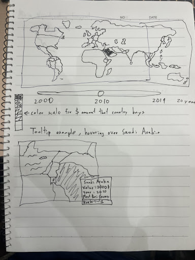

# US-Arms-Overseas
Group Members:

Tom Fu: cfu19@ucsc.edu

Turner Lu: tlu32@ucsc.edu

Brian Le: ble98@ucsc.edu

James Dinh: jatdinh@ucsc.edu

## 1. Why
The purpose of our project is to visualize the arms trade America has dealt throughout the world from 2000 to 2019. Therefore, our title shall be US Arms Sales Overseas.

Questions: What countries buy the most weapons from the United States? What year did the US sell the most weapons overseas? What types of weapons are sold most commonly?

## 2. Data Design

Countries that were sold weapons.
https://www.statista.com/statistics/248552/us-arms-exports-by-country/

Value of sold weapons.
https://www.statista.com/statistics/248552/us-arms-exports-by-country/ 

Year the weapon was sold
https://www.statista.com/statistics/248521/us-arms-exports/ 

Quantity of arms sold
https://data.worldbank.org/indicator/MS.MIL.XPRT.KD?end=2020&locations=US&start=1960&view=chart 

Weapon Types (Vehicles, Missiles, etc)
https://www.dsca.mil/press-media/major-arms-sales
https://www.statista.com/statistics/248558/us-arms-exports-by-weapon-category/ 
https://www.sipri.org/sites/default/files/2020-07/us_655_fy2019_0.pdf

## 3. Visualization Design

## 4. Visualization Resources
Global map (main visualization): countries that were sold are colored, lines going from us to country, Slider to adjust for year
https://medium.com/@ivan.ha/using-d3-js-to-plot-an-interactive-map-34fbea76bd78

Bar chart (optional visualization): Show amount gained from exporting weapons from a specific period (in this example 2000-2021)
https://www.statista.com/statistics/248521/us-arms-exports/ 

Geographic Map w/zoom titles
http://bl.ocks.org/piwodlaiwo/2f593e7186e56a18df72225a64ed43a1

Voronoi Arc (Optional)
https://bl.ocks.org/mbostock/7608400

Perfect Example
https://armsglobe.chromeexperiments.com/

Example of tooltips popping up when hovering over map provinces:
https://sureshlodha.github.io/CMPS263_Win2017/ChinaPopulationDensity/ 